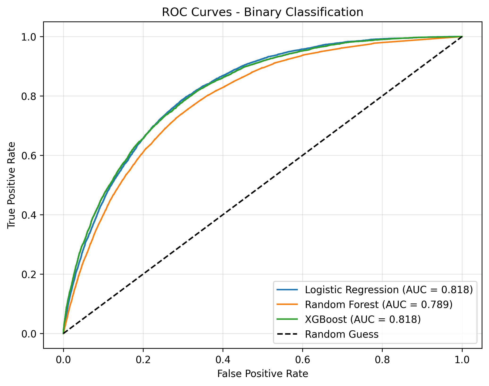
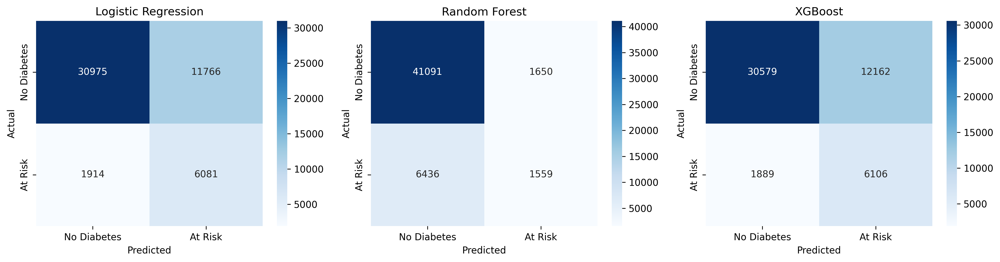
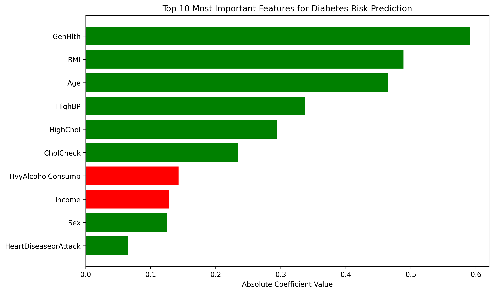

# Predicting Diabetes Risk Using Health and Lifestyle Indicators

## Project Overview

Diabetes is one of the most prevalent chronic diseases in the United States, affecting millions of individuals and placing a substantial burden on public health systems and the economy. Early identification of individuals at risk is critical, as lifestyle interventions and timely medical care can significantly reduce disease progression and long-term complications.

This project applies machine learning classification techniques to health and lifestyle survey data to evaluate whether diabetes risk can be accurately predicted using commonly collected indicators such as body mass index (BMI), physical activity, diet, and existing health conditions. In addition to predictive performance, this project seeks to understand which risk factors contribute most strongly to diabetes risk.

---

## Research Question

**Can we accurately predict an individual's diabetes risk using health and lifestyle indicators—such as BMI, physical activity, diet, and existing health conditions—through machine learning classification models?**

---

## Project Motivation

This project is motivated by both public health importance and personal experience. Diabetes has affected multiple generations within my family: my grandparents experienced diabetes-related complications, my parents have lived with diabetes for decades, and more recently, my older brother was diagnosed with prediabetes.

Witnessing the long-term health and lifestyle impacts of diabetes firsthand reinforced the importance of early risk identification—particularly at the prediabetes stage, where intervention can prevent or delay disease progression. This personal context directly informed the focus of this project on modifiable lifestyle factors and existing health conditions that are commonly available through public health surveys.

---

## Dataset

This project uses data from the **Behavioral Risk Factor Surveillance System (BRFSS) 2015**, a large-scale health-related telephone survey conducted annually by the Centers for Disease Control and Prevention (CDC).

| Attribute | Value |
|-----------|-------|
| Source | CDC BRFSS 2015 via Kaggle |
| Records | 253,680 |
| Features | 21 |
| Target Variable | Diabetes_012 |

**Dataset Link:** [Kaggle - Diabetes Health Indicators Dataset](https://www.kaggle.com/datasets/alexteboul/diabetes-health-indicators-dataset)

### Key Features

- **Anthropometric:** BMI
- **Lifestyle:** Physical activity, diet (fruit/vegetable consumption), smoking, alcohol use
- **Health Conditions:** High blood pressure, high cholesterol, heart disease, stroke
- **Self-Reported Health:** General, physical, and mental health status
- **Demographics:** Age, sex, education, income, healthcare access

For detailed feature descriptions, see [Data Dictionary](DATA_DICTIONARY.md)

---

## Modeling Approach

This project initially treated diabetes risk prediction as a multiclass classification problem (no diabetes, prediabetes, diabetes). However, due to extreme class imbalance and difficulty distinguishing prediabetes from no diabetes, the final model uses binary classification:

- 0 = No diabetes
- 1 = At Risk (prediabetes or diabetes)

Three machine learning models were evaluated:

| Model | Accuracy | Recall | Precision | AUC |
|-------|----------|--------|-----------|-----|
| Logistic Regression | 73% | 76% | 34% | 0.818 |
| Random Forest | 84% | 19% | 51% | 0.789 |
| XGBoost | 72% | 76% | 34% | 0.818 |

**Final Model:** Logistic Regression was selected for its strong recall (76%) and interpretability.

---

## Results

| Metric | Value |
|--------|-------|
| Model | Logistic Regression |
| Accuracy | 73% |
| At-Risk Recall | 76% |
| At-Risk Precision | 34% |
| AUC | 0.818 |

**Top Risk Factors Identified:**
1. Poor general health (GenHlth)
2. Higher BMI
3. Older age
4. High blood pressure
5. High cholesterol

---

## Visualizations

### ROC Curves


### Confusion Matrices


### Top 10 Risk Factors


---

## How to Run

1. Clone this repository
```bash
git clone https://github.com/ruhul-islam/diabetes-risk-prediction.git
```
2. Download the dataset from [Kaggle](https://www.kaggle.com/datasets/alexteboul/diabetes-health-indicators-dataset)
3. Place the CSV file in the project folder
4. Open `diabetes_prediction.ipynb` in Jupyter Notebook
5. Run all cells

---

## Tools and Libraries

- Python 3.x
- pandas
- NumPy
- scikit-learn
- XGBoost
- matplotlib
- seaborn
- Jupyter Notebook

---

## Limitations

- Data is self-reported and may contain recall bias
- No blood glucose or A1C values available
- Model predicts risk, not clinical diagnosis
- Cross-sectional data (single point in time)

---

## References

- Centers for Disease Control and Prevention. (2024). Diabetes risk factors. https://www.cdc.gov/diabetes/risk-factors/index.html
- World Health Organization. (2023). Diabetes fact sheet. https://www.who.int/news-room/fact-sheets/detail/diabetes
- American Diabetes Association. (2024). Understanding diabetes. https://diabetes.org/about-diabetes
- Teboul, A. (2021). Diabetes health indicators dataset. Kaggle. https://www.kaggle.com/datasets/alexteboul/diabetes-health-indicators-dataset